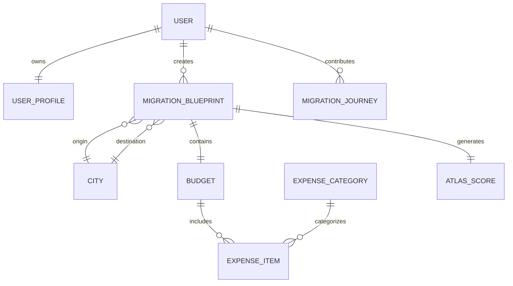

# Entity Relationship Diagram

-------------------------------------------------------------------------------------

# Relationship Notes

| Entity | Relationship |
|----------|--------------|
| User → Profile | One to One |
| User → Blueprint | One to Many |
| User → Journey | One to Many |
| Blueprint → Budget | One to One |
| Budget → Expense Items | One to Many |
| Expense Category → Expense Items | One to Many |
| Blueprint → Atlas Score | One to One |
| Blueprint → City | Many to One (Origin & Destination) |