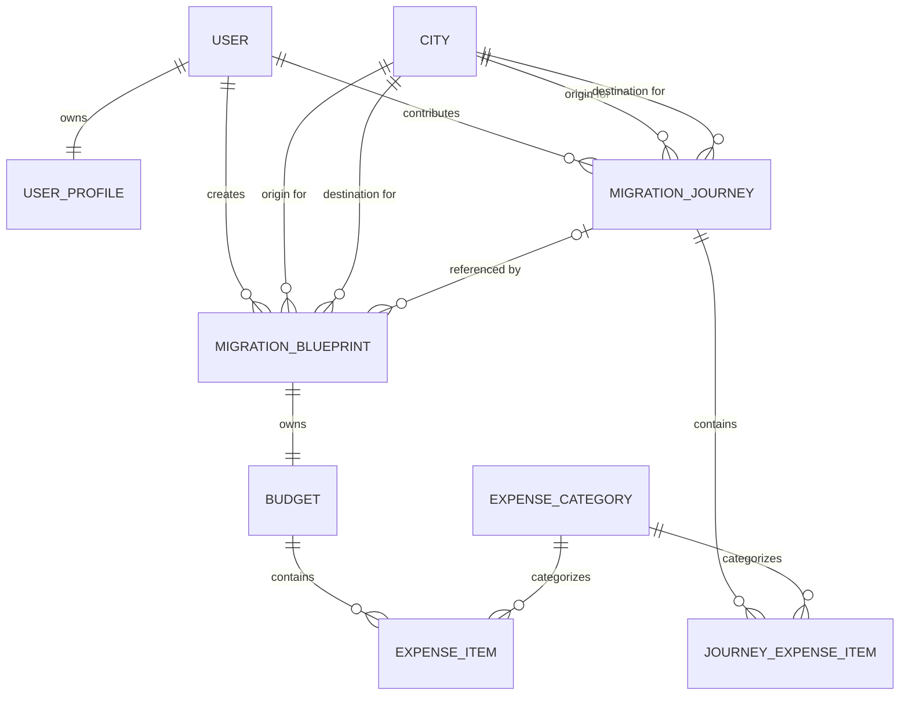

# Entity Relationship Diagram

> Version: 1.1
>
> Status: Draft

---

# Purpose

This document defines the high-level entity relationships for the LVN Atlas MVP.

It reflects the business concepts defined in `01-domain-model.md` and serves as the reference for designing the persistent data model.

Derived values such as Total Expenses, Expected Savings, Disposable Income, and Atlas Score are intentionally excluded as standalone entities.

---

# MVP Entity Relationship Diagram



---

# Relationship Notes

| Entity Relationship | Cardinality | Description |
|---|---|---|
| User → User Profile | One to One | Every user owns exactly one profile |
| User → Migration Blueprint | One to Many | A user may create multiple relocation scenarios |
| User → Migration Journey | One to Many | A user may contribute multiple real relocation journeys |
| City → Migration Blueprint | One to Many | A city may be referenced as the origin of multiple blueprints |
| City → Migration Blueprint | One to Many | A city may be referenced as the destination of multiple blueprints |
| City → Migration Journey | One to Many | A city may be referenced as the origin of multiple journeys |
| City → Migration Journey | One to Many | A city may be referenced as the destination of multiple journeys |
| Migration Blueprint → Budget | One to One | Every blueprint owns exactly one projected budget |
| Budget → Expense Item | One to Many | A budget contains multiple projected expenses |
| Expense Category → Expense Item | One to Many | Every projected expense belongs to a shared category |
| Migration Journey → Journey Expense Item | One to Many | A journey contains multiple actual expense records |
| Expense Category → Journey Expense Item | One to Many | Every journey expense belongs to a shared category |
| Migration Journey → Migration Blueprint | One to Many, Optional | A journey may be used as the reference source for multiple blueprints; a blueprint may have zero or one source journey |

---

# Origin and Destination Relationships

Migration Blueprints and Migration Journeys each reference the City entity twice:

```text
Migration Blueprint
├── Origin City
└── Destination City

Migration Journey
├── Origin City
└── Destination City
```

Although both relationships reference the same City entity, they represent different roles and must remain distinguishable in the persistent data model.

A relocation's Origin City and Destination City must not be the same.

---

# Blueprint and Journey Relationship

A Migration Blueprint may optionally reference a Migration Journey as its source or inspiration.

```text
Migration Journey
        │
        │ optional reference
        ▼
Migration Blueprint
        │
        ▼
Independent Budget
```

When a user creates a Blueprint based on a Journey, relevant expense data may be copied from the Journey into the Blueprint's Budget.

After creation, the Blueprint and its Budget are independent.

Changes to the original Migration Journey must not automatically modify existing Migration Blueprints.

---

# Derived Values

The following domain values are intentionally not represented as standalone entities in the MVP ER diagram:

- Total Expenses
- Expected Savings
- Disposable Income
- Atlas Score

These values are derived from underlying Blueprint, Budget, Expense, household, and other relevant domain data.

If historical tracking becomes a product requirement, dedicated snapshot entities may be introduced in a future version.

---

# MVP Persistent Entities

The MVP persistent model consists of:

1. User
2. User Profile
3. City
4. Migration Blueprint
5. Budget
6. Expense Category
7. Expense Item
8. Migration Journey
9. Journey Expense Item

These entities form the initial persistence boundary for the LVN Atlas MVP.